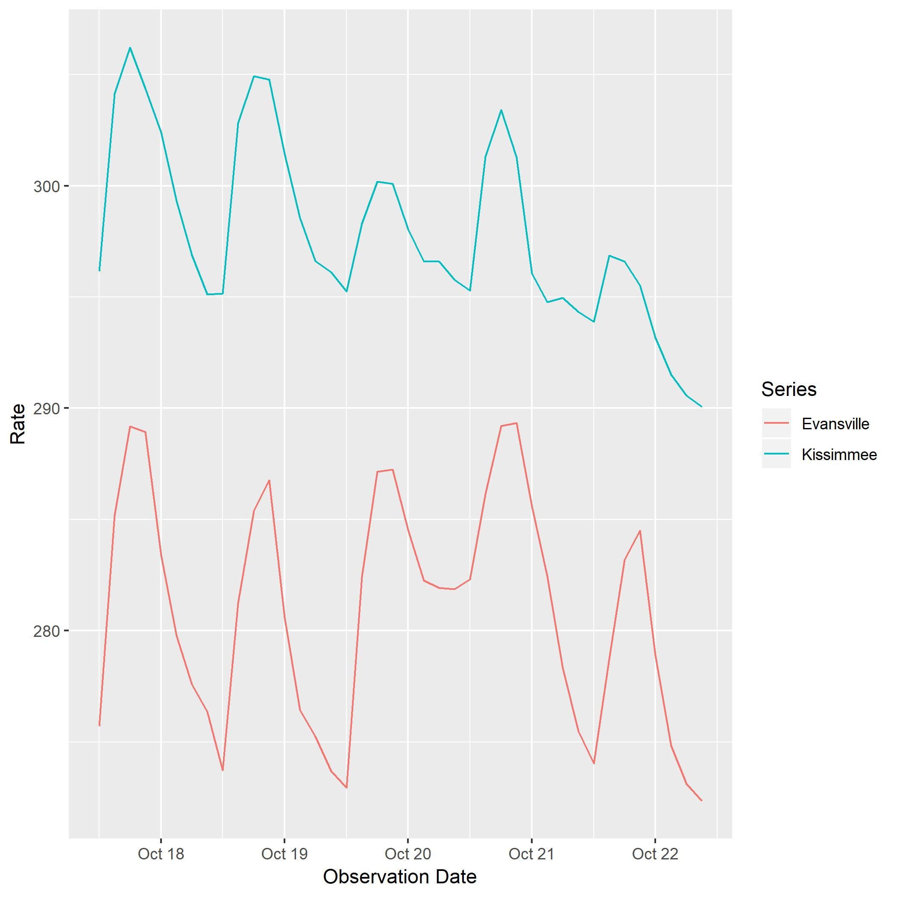

<!-- README.md is generated from README.Rmd. Please edit that file -->
OpenWeatherPull
===============

OpenWeatherPull provides a set of R bindings to the Open Weather Map API, provided by Open Weather Map. The functions allow the user to fetch time series observations. The core functions are

    openweather_set_key() - Set the required API key for the session.
    openweather() or openweather_series_observations() - Fetch a series.
    openweather_request() - Send a general request to the API.

Objects are returned as tibbles.

Example
-------

This is a basic example which shows you how to solve a common problem:

``` r
devtools::install_github("alexhallam/OpenWeatherPull")
openweather_set_key("my_api_key")
weather_data <- openweather(id = "4160983")
weather_data
```

`OpenWeatherPull` plays nicely with tidyverse packages:

``` r
library(tidyverse)
library(purrr)

map_dfr(c("4160983", "4257227"), openweather) %>%
  ggplot(data = ., mapping = aes(x = date_time, y = temp, color = name)) +
    geom_line() +
    labs(x = "Observation Date", y = "Rate", color = "Series")
```


